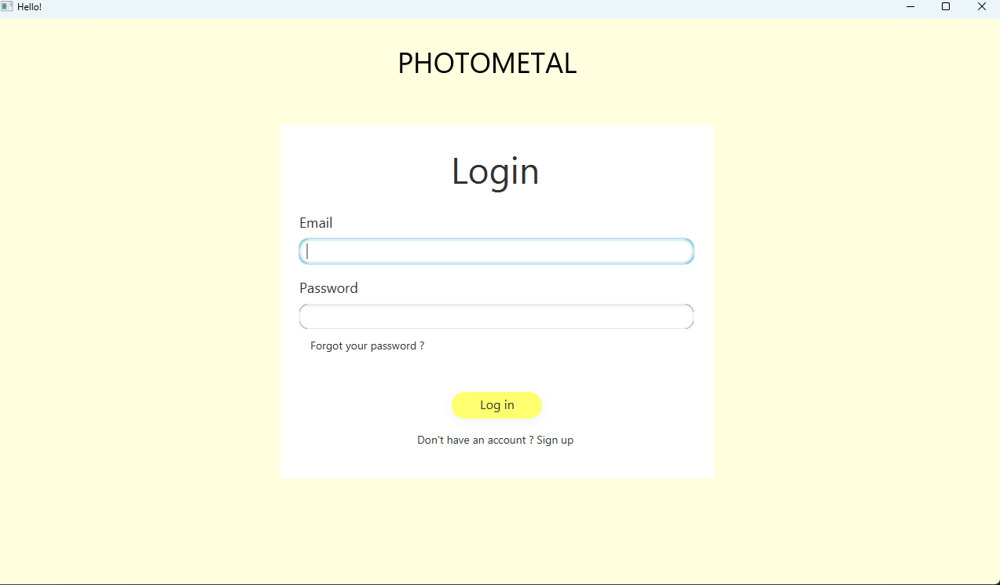
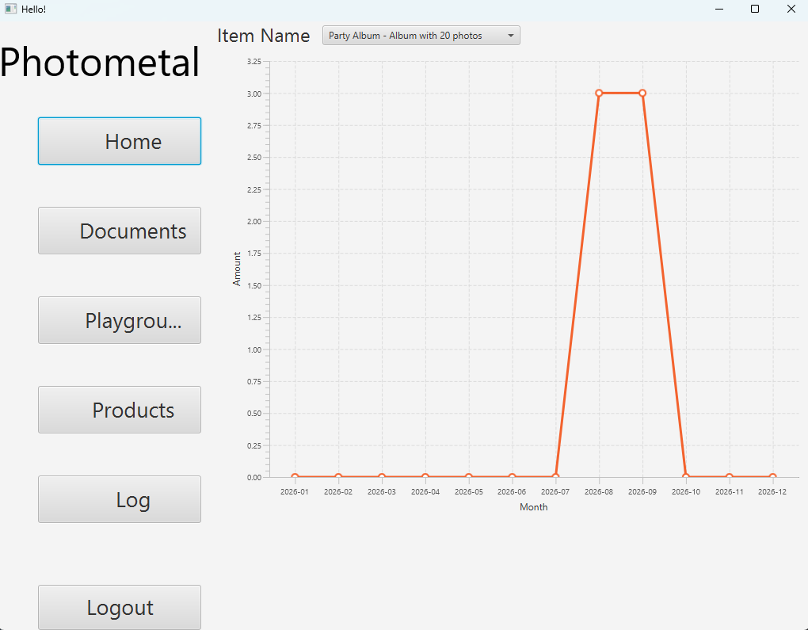
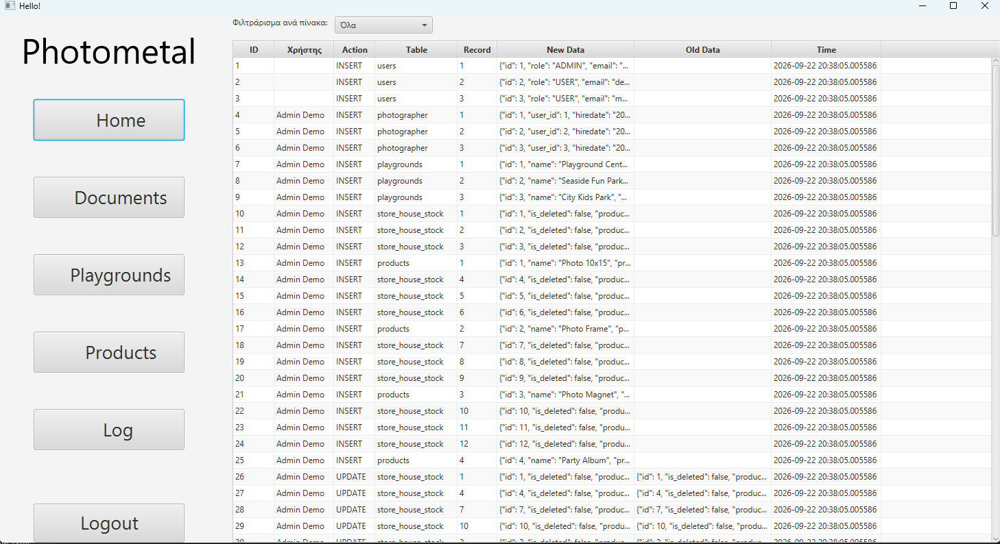

# PHOTOMETAL – Inventory & Work-Report Manager

A desktop application for a photography business that works at children's playgrounds.
Photographers log daily work reports (parties, customers, products sold), and administrators
manage products, playgrounds, stock per playground, users, and an audit trail of every change.

Built with **JavaFX** and **PostgreSQL**. Most business logic lives in the database
(stored functions, procedures and triggers), with a thin Java data-access layer on top.

## Screenshots

| Login | Admin view | Audit log |
|---|---|---|
|  |  |  |

## Features

- Login, registration and password reset, with passwords hashed by bcrypt (`pgcrypto`)
- Two roles, **ADMIN** and **USER**, each with its own screens
- Work reports per photographer and playground, with sold items per product
- Stock tracking per playground, initialised automatically when a product is created
- Soft delete for users, products and playgrounds, cascading through triggers
- Full audit log: every INSERT / UPDATE / DELETE on the main tables is recorded with the acting user
- Statistics: monthly sales per product and top-selling products

## Database design

| Table | Purpose |
|---|---|
| `users` | Login credentials (bcrypt hash) and role |
| `photographer` | Profile data linked 1–1 to a user |
| `playgrounds` | Work locations |
| `products` | Items sold |
| `store_house_stock` | Stock per product per playground |
| `work_reports`, `report_details` | Daily report header and its line items |
| `log_audit` | Change history written by triggers |

**Triggers (11):** audit triggers on 8 tables, soft-delete cascades for users, products and
playgrounds, and automatic stock initialisation for new products.
The current application user is passed to the audit triggers through a session
setting (`set_app_user_id` → `app.current_user_id`).

## Tech stack

Java 23 · JavaFX 17 · PostgreSQL (with `pgcrypto`) · JDBC · Maven

## Running locally

Requirements: JDK 23+, PostgreSQL 14+ running on `localhost:5432`.

1. Create the database and load the schema:
```bash
   createdb -U postgres Photometal
   psql -U postgres -d Photometal -f db/DatabaseLogic.sql
```
2. Open `src/main/java/com/example/photometal1/Database/Database_Connection.java`
   and set `user` and `password` to match your local PostgreSQL installation.
3. Run the app:
```bash
   ./mvnw clean javafx:run        # Linux / macOS
   mvnw.cmd clean javafx:run      # Windows
```
4. Click **Register** to create the first account.

## My contribution

This was a two-person university project.

- **Me:** the entire database side. That covers the PostgreSQL schema, all stored functions and procedures,
  the triggers (audit log, soft delete, stock initialisation), password hashing, and the
  Java data-access layer (`Dao/`, `Database/`).
-  **[Lampros](https://github.com/Lampirikios):** the JavaFX user interface (controllers and FXML views).

## Known limitations

- Password reset does not verify ownership of the email address (no confirmation code is sent).
  In a production system this would require an email verification step.